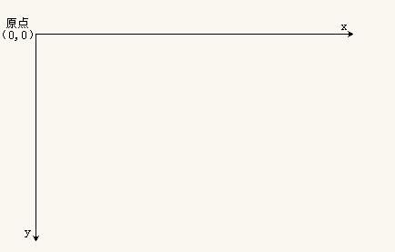
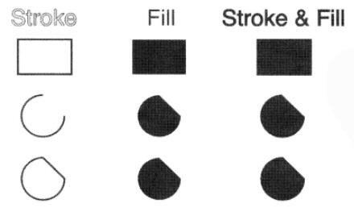
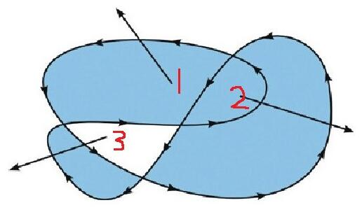

# Canvas
>canvas 最早由Apple引入WebKit,用于Mac OS X 的 Dashboard,后来又在Safari和Google Chrome被实现。 
>基于 Gecko 1.8的浏览器,比如 Firefox 1.5, 同样支持这个元素。  
>&lt;canvas&gt; 元素是WhatWG Web applications 1.0规范的一部分,也包含于HTML 5中。  

### 体验Canvas

#### 什么是Canvas？
HTML5 的 canvas 元素使用 JavaScript 在网页上绘制图像。  
画布是一个矩形区域，您可以控制其每一像素。  
canvas 拥有多种绘制路径、矩形、圆形、字符以及添加图像的方法。

#### 创建Canvas元素 
向 HTML5 页面添加 canvas 元素。  
规定元素的 id、宽度和高度：
```html
    <canvas id="myCanvas" width="200" height="100"></canvas>
```
#### Canvas坐标系


#### 通过JavaScript来绘制
```javascript
    /*获取元素*/
    var myCanvas = document.querySelector('#myCanvas');
    /*获取绘图工具*/
    var context = myCanvas.getContext('2d');
    /*设置绘图的起始位置*/
    context.moveTo(100,100);
    /*绘制路径*/
    context.lineTo(200,200);
    /*描边*/
    context.stroke();
```

### Canvas的基本使用

#### 图形绘制
需要理解些概念：  
- 路径的概念
- 路径的绘制
    + 描边 stroke()  
    + 填充 fill()  
        
- 闭合路径
    + 手动闭合
    + 程序闭合 closePath()
- 填充规则(非零环绕)  
  
- 开启新的路径 beginPath()

#### 设置样式
- 画笔的状态
    + lineWidth 线宽，默认1px
    + lineCap 线末端类型：(butt默认)、round、square 
    + lineJoin 相交线的拐点 miter(默认)、round、bevel
    + strokeStyle 线的颜色
    + fillStyle 填充颜色
    + setLineDash() 设置虚线
    + getLineDash() 获取虚线宽度集合
    + lineDashOffset 设置虚线偏移量（负值向右偏移）

#### 实例练习
- 渐变色绘制
- 镂空的房子
- 绘制坐标网格
- 绘制坐标系
- 绘制坐标点
- 绘制折线图

#### 参考文档
- [w3school](http://www.w3school.com.cn/tags/html_ref_canvas.asp)
- [Canvas_API](https://developer.mozilla.org/zh-CN/docs/Web/API/Canvas_API/Tutorial)

### Canvas图形绘制

#### 矩形绘制
- rect(x,y,w,h) 没有独立路径
- strokeRect(x,y,w,h) 有独立路径，不影响别的绘制
- fillRect(x,y,w,h) 有独立路径，不影响别的绘制
- clearRect(x,y,w,h) 擦除矩形区域

#### 圆弧绘制
- 弧度概念
- arc()
    + x 圆心横坐标
    + y 圆心纵坐标
    + r 半径
    + startAngle 开始角度
    + endAngle 结束角度
    + anticlockwise 是否逆时针方向绘制（默认false表示顺时针；true表示逆时针）

#### 绘制文本
- ctx.font = '微软雅黑' 设置字体
- strokeText()
- fillText(text,x,y,maxWidth)
    + text 要绘制的文本
    + x,y 文本绘制的坐标（文本左下角）
    + maxWidth 设置文本最大宽度，可选参数
- ctx.textAlign文本水平对齐方式，相对绘制坐标来说的
    + left
    + center
    + right
    + start 默认
    + end
- ctx.direction属性css(rtl ltr) start和end于此相关
    + 如果是ltr,start和left表现一致
    + 如果是rtl,start和right表现一致
- ctx.textBaseline 设置基线（垂直对齐方式  ）
    + top 文本的基线处于文本的正上方，并且有一段距离
    + middle 文本的基线处于文本的正中间
    + bottom 文本的基线处于文本的证下方，并且有一段距离
    + hanging 文本的基线处于文本的正上方，并且和文本粘合
    + alphabetic 默认值，基线处于文本的下方，并且穿过文字
    + ideographic 和bottom相似，但是不一样
- measureText() 获取文本宽度obj.width

#### 实例练习
- 绘制扇形
- 绘制圆角矩形
- 绘制圆
- 绘制饼图

### 做动画
#### 绘制图片
- drawImage()
    + 三个参数drawImage(img,x,y)
        - img 图片对象、canvas对象、video对象
        - x,y 图片绘制的左上角
    + 五个参数drawImage(img,x,y,w,h)
        - img 图片对象、canvas对象、video对象
        - x,y 图片绘制的左上角
        - w,h 图片绘制尺寸设置(图片缩放，不是截取)
    + 九个参数drawImage(img,x,y,w,h,x1,y1,w1,h1)
        - img 图片对象、canvas对象、video对象
        - x,y,w,h 图片中的一个矩形区域
        - x1,y1,w1,h1 画布中的一个矩形区域

#### 序列帧动画
- 绘制精灵图
- 动起来
- 控制边界
- 键盘控制

#### 坐标变换
- 平移 移动画布的原点
    + translate(x,y) 参数表示移动目标点的坐标
- 缩放
    + scale(x,y) 参数表示宽高的缩放比例
- 旋转
    + rotate(angle) 参数表示旋转角度


​    


